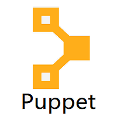

# :vulcan_salute: Welcome to my Profile
I am Vaibhav Gulati, a third-year Computer Science undergraduate student at Bharati Vidyapeeth's College of Engineering (BVCOE), New Delhi, India :man_student: .

## Languages and Tools :computer:

         
   &nbsp; &nbsp;   
 &nbsp;        
 &nbsp;  &nbsp; 

## Other Stuff :open_file_folder:

  
 Github Analytics :chart: 

   

   &nbsp;&nbsp;
  

  
 Projects :package: 

   
  <ol>
    <li> <a href="https://github.com/gulvaibhav20/Instagram-Style-Photo-Collage">Instagram Style Photo Collage </a>
    <li> <a href="https://github.com/gulvaibhav20/Web-Scrapping">Web Scrapping </a>
    <li> <a href="https://github.com/gulvaibhav20/Automation">Automation </a>
    <li> <a href="https://github.com/gulvaibhav20/GRIP_Sparks_Foundation_Tasks">GRIP Sparks Foundation Tasks </a>
  </ol>

  
 More about me :bulb: 

   
  - In my free time, I write tech articles on Hashnode and Medium.  
  - My Hobbies :  
  &nbsp;&nbsp;&nbsp;   
    

## Reach out to me :wave:

 &nbsp;
 &nbsp;
 &nbsp;
 &nbsp;
 &nbsp;
 &nbsp;

